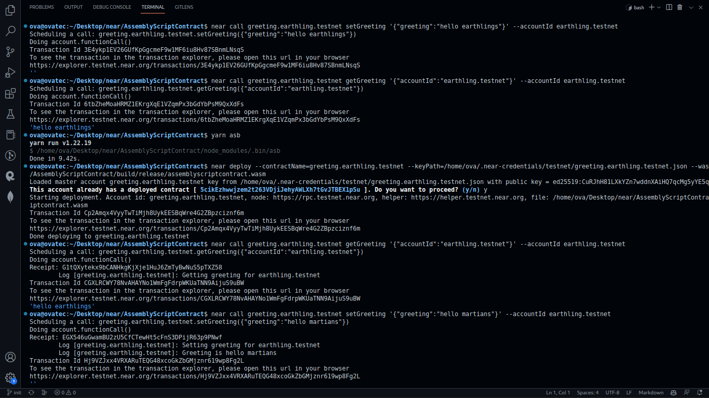

  
   

  <h3><b>README</b></h3>

<!-- TABLE OF CONTENTS -->

# 📗 Table of Contents

- [📖 About the Project](#about-project)
  - [🛠 Built With](#built-with)
    - [Tech Stack](#tech-stack)
    - [Key Features](#key-features)
  - [🚀 Live Demo](#live-demo)
- [💻 Getting Started](#getting-started)
  - [Setup](#setup)
  - [Prerequisites](#prerequisites)
  - [Install](#install)
  - [Usage](#usage)
  - [Run tests](#run-tests)
  - [Deployment](#triangular_flag_on_post-deployment)
- [👥 Authors](#authors)
- [🔭 Future Features](#future-features)
- [🤝 Contributing](#contributing)
- [⭐️ Show your support](#support)
- [🙏 Acknowledgements](#acknowledgements)
- [❓ FAQ](#faq)
- [📝 License](#license)

<!-- PROJECT DESCRIPTION -->

# 📖 [AssemblyScript Smart Contract] 

AssemblyScript Smart Contract is an SC that is written in AssemblyScript and compiled to WASM. It is a simple SC that has a setter and a getter for greetings. It is deployed in NEAR TestNet and can be accessed using the NEAR CLI. 

## 🛠 Built With 

### Tech Stack 

> AssemblyScript Smart Contract is built using the following technologies:-

- [AssemblyScript](https://www.assemblyscript.org/)
- [NEAR CLI](https://docs.near.org/docs/tools/near-cli)
- [NEAR TestNet](https://docs.near.org/docs/develop/basics/create-account#creating-a-testnet-account)
- [NEAR Studio](https://studio.near.org/)
- [NEAR Wallet](https://wallet.near.org/)
- [NEAR Explorer](https://explorer.testnet.near.org/)
- [NEAR API](https://docs.near.org/docs/api/naj-quick-reference)

<!-- Features -->

### Key Features 

> The catalog of my Assembly Script Smart Contract  has the following features:-

- [x] Setter and Getter for greetings
- [x] Deployed in NEAR TestNet
- [x] Can be accessed using NEAR CLI
 

(<a href="#readme-top">back to top</a>)

<!-- GETTING STARTED -->

## 💻 Getting Started 

### Prerequisites

In order to run this project you need:
## Windows users

## Linux
coming soon
## Macos
coming soon

### Setup
You can download the page by clicking in the code green button and select Download ZIP or if you are a developer. You can get the https link or ssh link just copy it and use your favourite command line git interface and write this `git clone https://github.com/OmarMWarraich/AssemblyScriptContract.git` if you use https or write `git clone git@github.com:OmarMWarraich/blog-ror.git` if you use ssh

### Usage

- Open your terminal and change the directory to the location of this repo using this command `cd file_path`
- Run this command `npm i` to install all the dependencies

(<a href="#readme-top">back to top</a>)

## Tests 

- Coming soon

<!-- AUTHORS -->

## 👥 Author 

👤 **OmarMWarraich**

- GitHub: [@OmarMWarraich](https://github.com/OmarMWarraich)
- Twitter: [@omarwarraich1](https://twitter.com/omarwarraich1)
- LinkedIn: [o-va](https://www.linkedin.com/in/o-va/)

(<a href="#readme-top">back to top</a>)

<!-- CONTRIBUTING -->

## 🤝 Contributing 

Contributions, issues, and feature requests are welcome!

Feel free to check the [issues page](../../issues/).

(<a href="#readme-top">back to top</a>)

<!-- SUPPORT -->

## ⭐️ Show your support 

If you like this project give it a ⭐️ and share this projects with your friends 

(<a href="#readme-top">back to top</a>)

<!-- FAQ (optional) -->

## ❓ FAQ 

- Does this App has a GUI?

  - No.

- What is the name of Blockchain this contract is deployed to?

  - This contract is deployed to NEAR TestNet.

(<a href="#readme-top">back to top</a>)

<!-- LICENSE -->

## 📝 License 

This project is [MIT](./LICENSE) licensed.

(<a href="#readme-top">back to top</a>)

